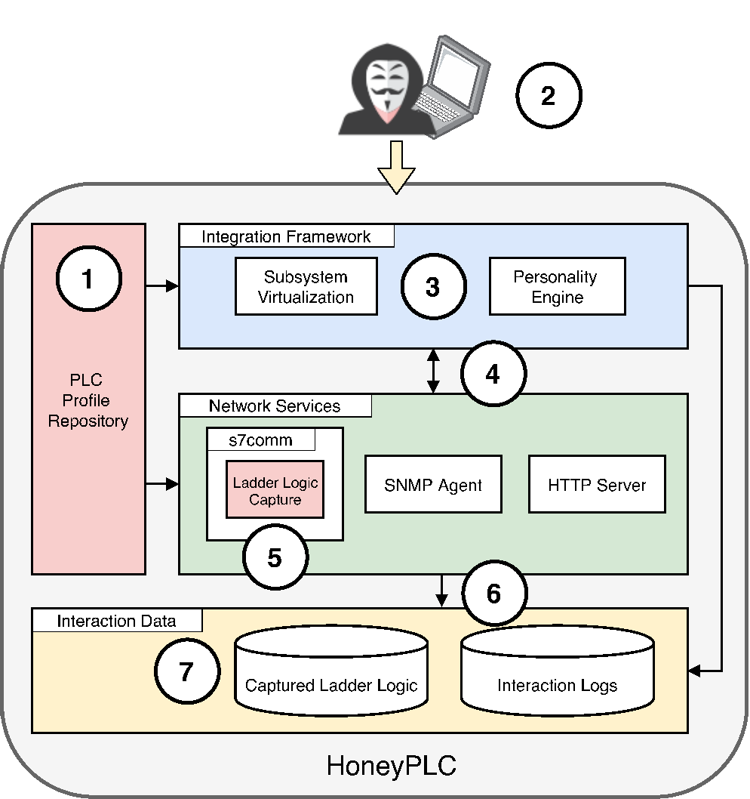

# HoneyPLC

## Overview

HoneyPLC is a high interaction PLC honeypot designed to simulate multiple PLC models from different vendors. It can log S7comm interactions and can store Ladder Logic programs injected by an attacker. It can also log SNMP get requests and HTTP login attempts.

It is brought to you by the cybersecurity lab [SEFCOM at Arizona State University](http://sefcom.asu.edu) and [Efrén López](https://efrenlopezm.github.io/).

The S7comm portion of HoneyPLC is built on top of [Snap7](https://github.com/SCADACS/snap7)

<p align="center">
   
</p>

## Research Paper

**HoneyPLC: A Next-Generation Honeypot for Industrial Control Systems** 
[[PDF]](https://efrenlopezm.github.io/stuff/honeyplc-lopez-morales.pdf) <br />
Efrén López-Morales, Carlos Rubio-Medrano, Adam Doupé, Yan Shoshitaishvili, Ruoyu (Fish) Wang, Tifanny Bao, Gail-Joon Ahn<br />
*In Proceedings of the 2020 ACM SIGSAC Conference on Computer and Communications Security (CCS ’20)*

If you use *HoneyPLC* in a scientific publication, we would appreciate citations using this **BibTex** entry:
``` tex
@inproceedings{lopez-morales_honeyplc_20,
 author    = {Efr\'en L\'opez-Morales and Carlos Rubio-Medrano and Adam Doup\'e and Yan Shoshitaishvili and Ruoyu Wang and Tifanny Bao and Gail-Joon Ahn},
 booktitle = {In Proceedings of the 2020 ACM SIGSAC Conference on Computer and Communications Security (CCS ’20)},
 month     = {Nov},
 title     = {HoneyPLC: A Next-Generation Honeypot for Industrial Control Systems},
 year      = {2020}
}
```

## Features

S7comm features:
* Fake PLC memory blocks with the ability to upload and download ladder logic programs.
* Possibility to read PLC hardware information, e.g., firmware, name, model.
* Interaction logs that include source IP address, S7comm function commands, blocks accessed, blocks downloaded/uploaded.
* Possibility to capture Ladder logic programs and save them to filesystem for future analysis. 

## Requirements

Software required:

* An operating system (tested on Ubuntu 18 LTS 64-bit)
* [Honeyd](https://github.com/DataSoft/Honeyd)
* Python 2.5+
* [python-nmap](https://pypi.org/project/python-nmap/)
* [snmpsim](https://github.com/etingof/snmpsim)
* [lighttpd](https://www.lighttpd.net/)

## How to install it?

Install [Honeyd](https://github.com/DataSoft/Honeyd) and all its dependencies.

* Append the necessary nmap fingerprints to the Honeyd fingerprint database:

`/usr/share/honeyd/nmap-os-db`

Install S7comm Server and library.

* Install the modified Snap7 [libsnap7.so](https://github.com/sefcom/honeyplc/tree/master/snap7/build/bin/x86_64-linux) file:

`/usr/lib/libsnap7.so`

* Install the [s7commServer](https://github.com/sefcom/honeyplc/blob/master/snap7/examples/cpp/x86_64-linux/server):

`/usr/share/honeyd/s7commServer`

`chmod 777 s7commServer`

## How to run it?

Edit the honeyd template file with the correct IP address and subsystems paths.

Example:

```
create base
add base subsystem "/usr/share/honeyd/s7commServer" shared restart

clone host1 base
set host1 personality "Siemens Simatic 300 programmable logic controller"


bind 192.168.0.100 host1
```

Run Honeyd with the corresponding PLC Profile honeyd teamplate:

Example

`sudo honeyd -d -f config.s7-300 192.168.0.0/24`

You can also run the S7comm Server separately passing the IP address argument:

Example

`sudo s7commServer 127.0.0.1`

The S7comm Server will save all interactions in `s7comm.log`

The captured ladder logic programs will be saved in the same directory where the applicacion is.

## How to modify source code and recompile?

To rebuild the libsnap7.so library follow the steps in the [Snap7 Reference Manual](https://github.com/sefcom/honeyplc/blob/master/snap7/doc/Snap7-refman.pdf).

The libsnap7.so file library contains the ladder logic capture code and the different Siemens PLCs hardware information.

To rebuild the s7commServer navigate to the correct architecture, for example:

`snap7/examples/cpp/x86_64-linux/`

`make` and look for the `server` file.

## Profiler Tool

The Profiler tool creates a PLC Profile that can later be simulated by HoneyPLC.

usage: profiler.py &lt;address&gt; &lt;profile&gt;

Run profiler.py to create a new HoneyPLC profile.
Write the IP address of the PLC host.
Write the name of the profile to be created.
A new directory with the profile data will be created.

Example
`python profiler.py 192.168.0.100 NewProfile`

## Experimental Data

* [PLC Profiles](https://github.com/sefcom/honeyplc/tree/master/plc-profiles)
* [AWS pcaps](https://drive.google.com/drive/folders/1xA3mu7gBI9aPSSlrjJo1S9r-VvZg_izl?usp=sharing)


## I have some questions!

I ~~am~~ _might be_ reachable via e-mail: *edlopezm* at *asu* dot *edu*.
